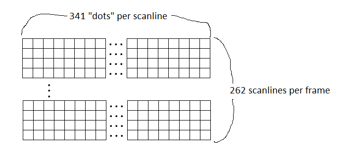
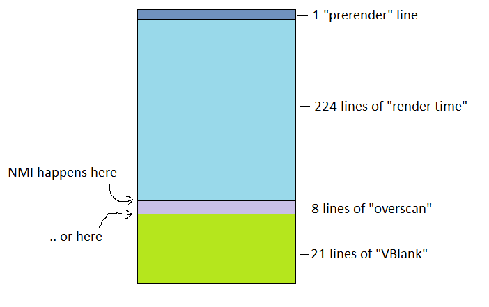
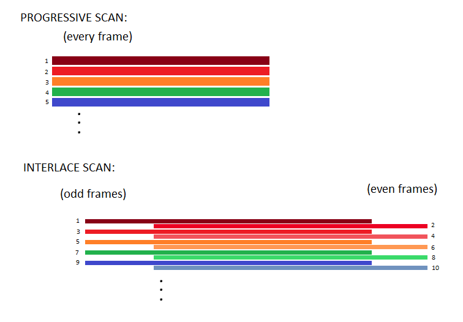
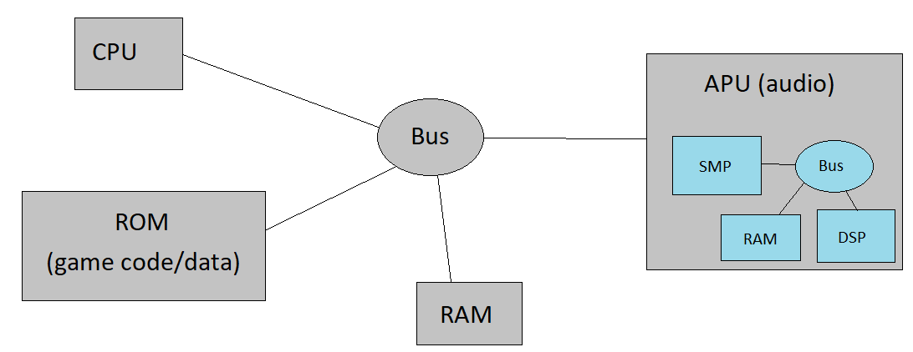

### [Proposal](proposal.md) - [Timeline](timeline.md) - [Journal](journal.md) - [Bibliography](bibliography.md) - [Samples](samples.md)

# Samples

##  Second presentation stuff

#### The frame is a series of scanlines.  A scanline is a series of dots.

#### Different scanlines do different things!!!

#### Progressive vs. Interlace?  wtf?

##  First presentation stuff

Link to the CPU code I want to show:  [cpu.cpp](../src/emucore/cpu/cpu.cpp)

SNES Roadmap:

